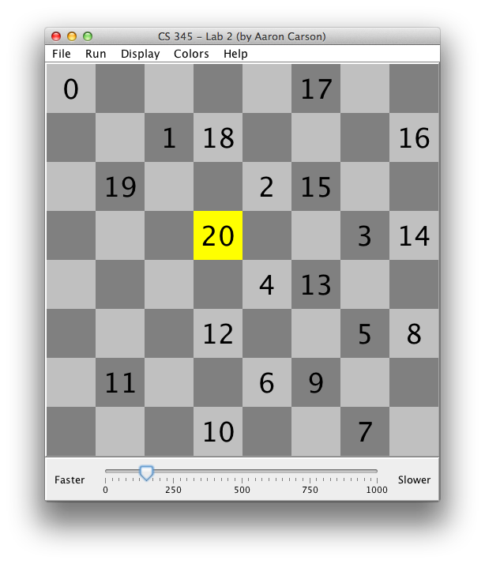

# KnightsTourProblem

This project finds a solution to the
[Knight's Tour problem](https://en.wikipedia.org/wiki/Knight%27s_tour)
using a depth first, backtracking algorithm.



Originally developed at WOU for CS 345, Lab 2.  Authored May 14th, 2014.

## Build

```
javac Lab2GUI.java
java Lab2GUI
```
